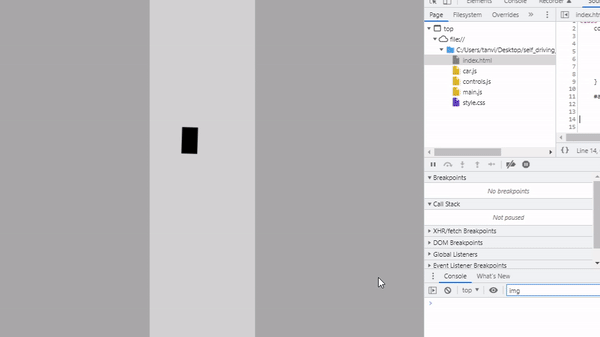
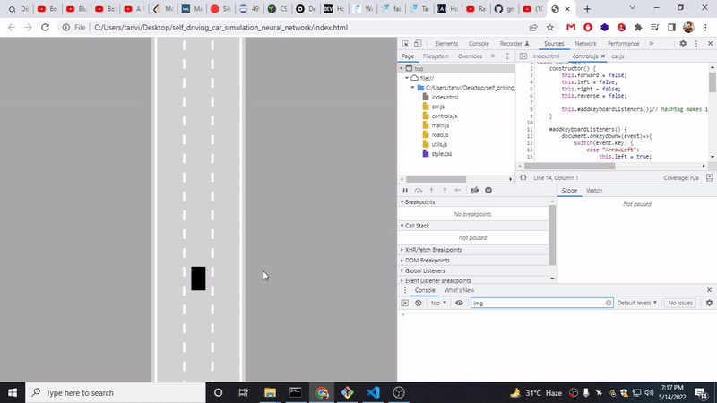
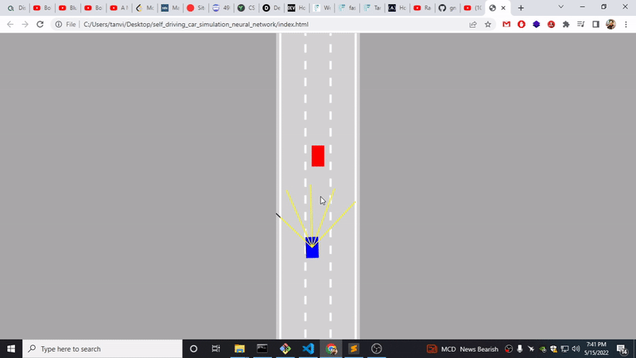

# SELF DRIVING CAR SIMULATED ON WEB BROWSER 
## Building a simulated self driving car in browser using only javascript without any library
## Day 1
### Today is the car physics part, learned how private method works in object oriented javascript, 
How physics and math works in real world simulation. Lot's of sin and cosine angle involved.
Overall it was fun.

## Day 2
### Today finished the Road with lots of Math and Physics equations involved. 
It was fun

## Day 3
### Finished adding Traffic 
